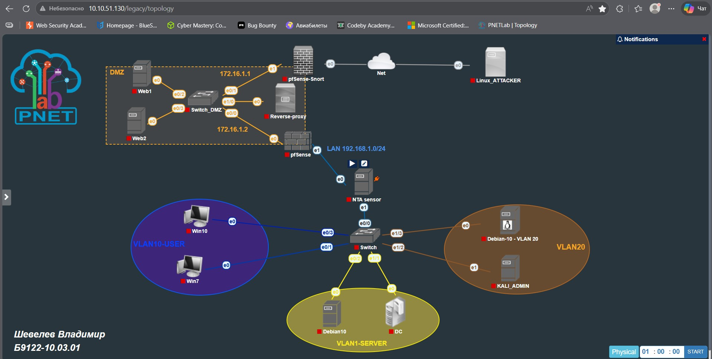

# Паспорт проекта
## Прототип интеллектуальной системы обнаружения аномалий в корпоративной сети

### 1. Назначение

Программа представляет собой прототип аналитического ядра интеллектуальной системы обнаружения аномалий в корпоративной сети.
Основная задача — обработать журналы событий из разных источников, выделить признаки сетевого поведения, обнаружить аномалии, сгруппировать их в карточки потенциальных инцидентов и выдать объяснимый результат с уровнем риска, MITRE ATT&CK-классификацией и рекомендацией.

Программа не заменяет IDS/IPS, SIEM или NTA/NDR-системы. Она используется как дополнительный аналитический слой поверх журналов и срабатываний этих средств.

```text
pfSense / Snort / Suricata / Reverse proxy / Linux / Windows / Arkime
        ↓
нормализованные журналы событий
        ↓
расчет признаков поведения
        ↓
правила + ML-модель + показатель аномальности
        ↓
карточка аномалии / потенциального инцидента
        ↓
риск + MITRE ATT&CK + контекст актива + рекомендация
```

---

### 2. Область применения

Прототип предназначен для анализа событий корпоративной сети в лабораторной или учебно-практической среде. Он может использоваться для:

- анализа журналов межсетевых экранов;
- обработки IDS/IPS-срабатываний;
- анализа HTTP/DNS/auth-событий;
- выявления сетевых и сервисных аномалий;
- демонстрации метода обнаружения аномалий в рамках ВКР;
- ретроспективной проверки событий по выгруженным журналам.

В текущей версии программа работает с загруженными CSV/JSON/JSONL-файлами. Режим постоянного фонового сбора логов может быть добавлен позднее через Syslog, API SIEM/ELK, Suricata EVE JSON, Windows Event Log или агенты доставки журналов.

---

### 3. Стендовая топология



Пример адресации:

| Узел | IP-адрес |
|---|---|
| pfSense-Snort WAN | `10.10.51.133` |
| pfSense-Snort LAN / DMZ | `172.16.1.1` |
| pfSense-Suricata WAN / DMZ | `172.16.1.2` |
| pfSense-Suricata LAN | `192.168.1.1` |
| VLAN10 gateway | `192.168.10.1` |
| VLAN20 gateway | `192.168.20.1` |
| Reverse proxy | `172.16.1.10` |
| Web1 | `172.16.1.11` |
| Web2 | `172.16.1.12` |
| Domain Controller | `192.168.1.200` |
| Debian10 / File Server | `192.168.1.102` |
| Windows 7 | `192.168.10.100` |
| Windows 10 | `192.168.10.101` |
| Kali Admin | `192.168.20.102` |
| Debian10 VLAN20 | `192.168.20.101` |
| NTA sensor / Arkime | `192.168.1.50` |
| Linux_ATTACKER | `10.10.51.20` |

Топология используется не как источник детектирования, а как контекст для оценки риска. Например, аномалия на DMZ-сервере, контроллере домена или файловом сервере получает более высокий приоритет, чем аналогичная активность на менее критичном узле.

---

### 4. Поддерживаемые источники событий

| Источник | Тип событий | Для чего используется |
|---|---|---|
| pfSense | соединения, блокировки, разрешения, направления трафика | сканирование, флуд, исходящие соединения, межсегментная активность |
| Snort | IDS-срабатывания, сигнатуры атак | подтверждение известных сетевых сценариев |
| Suricata | IDS/IPS, HTTP, DNS, TLS, сетевые события | сетевые атаки, web-аномалии, DNS-аномалии |
| Reverse proxy / Nginx | HTTP-запросы, URI, коды ответов | web probing, SQLi/XSS/path traversal-признаки |
| Linux auth/syslog | SSH-входы, ошибки входа, системные события | подбор учетных данных, подозрительные подключения |
| Windows Event Log / Sysmon | входы, процессы, PowerShell, службы, задачи | расширение для host/AD-аномалий |
| Arkime / NTA | сетевые сессии, направления, объемы | beaconing, exfiltration, нетипичные связи |
| DNS logs | домены, NXDOMAIN, частота запросов | DNS tunneling, DGA-подобная активность |


---

### 4.1. Откуда выгружались журналы для демонстрационного набора

Демонстрационный набор журналов сформирован под стендовую топологию корпоративной сети и имитирует выгрузку событий из нескольких источников мониторинга.  
В реальной эксплуатации эти источники могут передавать события напрямую в центральное хранилище, SIEM/ELK или выгружаться вручную в CSV/JSON для последующей нормализации.

| Источник в стенде | Откуда берутся журналы | Какие события используются | Какой тип события в программе |
|---|---|---|---|
| `pfSense-Snort` | `Status → System Logs → Firewall`, `/var/log/filter.log`, Snort Alerts | разрешенные/заблокированные соединения, сканирование, IDS-срабатывания | `net_conn`, `ids_alert` |
| `pfSense-Suricata` | `Status → System Logs → Firewall`, Suricata Alerts, `eve.json` при наличии | межсегментные соединения, подозрительные сетевые события, IDS/IPS-срабатывания | `net_conn`, `ids_alert`, `http`, `dns` |
| `Reverse proxy / Nginx` | `/var/log/nginx/access.log`, `/var/log/nginx/error.log` | HTTP-запросы, URI, методы, коды ответов, ошибки веб-сервиса | `http` |
| `WEB1 / WEB2` | журналы веб-приложений и веб-сервера | обращения к сервисам, ошибки, признаки SQLi/XSS/path traversal | `http` |
| `Domain Controller` | Windows Event Log: Security, DNS Server logs | входы пользователей, ошибки входа, DNS-запросы, события AD | `auth`, `dns`, `system` |
| `Windows 7 / Windows 10` | Windows Event Log, Sysmon при наличии | пользовательская активность, сетевые соединения, процессы, PowerShell | `auth`, `process`, `system`, `net_conn` |
| `Debian10 File Server` | `/var/log/auth.log`, `/var/log/syslog`, журналы SSH/SMB | SSH-входы, неудачные попытки входа, системные события | `auth`, `system`, `net_conn` |
| `Kali Admin / Debian10 Admin` | системные журналы Linux, история административных проверок | легитимные административные подключения и проверки | `net_conn`, `auth` |
| `NTA sensor / Arkime` | Arkime Sessions, экспорт сетевых сессий | сетевые сессии, направления, объемы, длительность соединений | `net_conn` |
| `Linux_ATTACKER` | тестовый источник трафика стенда | сканирование, web probing, brute force, flood, reverse shell/C2-сценарии | используется как `src_ip` в событиях |

В текущем демонстрационном CSV события уже приведены к единой нормализованной структуре. То есть программа получает не сырые файлы `filter.log`, `access.log` или `Security.evtx`, а подготовленную таблицу, где события из разных источников сведены к общим полям:

```text
timestamp, source, event_type, src_ip, dst_ip, src_port, dst_port,
proto, outcome, user, domain, uri, bytes, duration, rule_id,
signature, method, status_code, user_agent, event_id,
process_name, command_line, true_label
```

#### Примеры соответствия источников и классов аномалий

| Класс аномалии | Основные источники логов |
|---|---|
| `scan` | pfSense, Snort, Suricata, Arkime |
| `bruteforce` | Linux `auth.log`, Windows Security, VPN/SSH/AD-логи |
| `flood` | pfSense, Reverse proxy, web logs |
| `web_attack` | Reverse proxy, Nginx, WAF, Suricata/Snort alerts |
| `dns_anomaly` | DNS Server logs, Suricata DNS, Arkime |
| `lateral_movement` | pfSense-Suricata, Windows/Sysmon, Arkime |
| `data_exfiltration` | pfSense, proxy, Arkime/NTA |
| `malware_beaconing` | pfSense, DNS, proxy, Arkime/NTA |
| `suspicious_outbound` | pfSense, Suricata, Arkime, Windows/Sysmon |
| `unknown_anomaly` | любые нормализованные события, если поведение отклоняется от локального профиля |

Важно: в реальной сети `true_label` отсутствует. Он добавляется только в демонстрационный набор для проверки качества модели и расчета метрик. При обработке реальных логов программа использует правила, профили угроз, слабую разметку, модель и показатель аномальности.


---

### 5. Формат входных данных

Прототип принимает нормализованные журналы событий в формате CSV, JSON или JSONL.

#### Минимальные поля

| Поле | Назначение |
|---|---|
| `timestamp` | время события |
| `source` | источник события: pfSense, Snort, Suricata, Reverse-proxy, Windows, Linux, Arkime |
| `event_type` | тип события: `net_conn`, `auth`, `http`, `dns`, `ids_alert`, `process`, `system` |
| `src_ip` | IP-адрес источника |
| `dst_ip` | IP-адрес назначения |
| `src_port` | порт источника |
| `dst_port` | порт назначения |
| `proto` | протокол: TCP, UDP, ICMP, HTTP, DNS |
| `outcome` | результат события: `success`, `failure`, `blocked`, `alert` |

#### Дополнительные поля

| Поле | Назначение |
|---|---|
| `user` | учетная запись |
| `domain` | DNS-запрос или домен |
| `uri` | URI HTTP-запроса |
| `method` | HTTP-метод |
| `status_code` | HTTP-код ответа |
| `bytes` | объем переданных данных |
| `duration` | длительность соединения |
| `rule_id` | ID правила IDS/IPS/Sigma |
| `signature` | название сигнатуры или алерта |
| `user_agent` | User-Agent |
| `event_id` | Windows Event ID |
| `process_name` | имя процесса |
| `command_line` | командная строка |
| `true_label` | эталонная метка для проверки качества на тестовом наборе |

`true_label` не требуется для реальной работы программы. Он нужен только для экспериментальной оценки качества: расчета TP, FP, FN, TN, точности, полноты, F1-меры и ROC-AUC.

---

### 6. Этапы метода детектирования

```text
1. Получение журналов
2. Нормализация событий
3. Очистка и приведение типов
4. Агрегация во временные окна
5. Расчет признаков поведения
6. Слабая разметка по профилям угроз
7. Обучение модели
8. Расчет показателя аномальности
9. Гибридное детектирование
10. Группировка аномалий
11. Формирование карточки
12. Приоритизация риска
13. MITRE ATT&CK-классификация
14. Обогащение контекстом активов и уязвимостей
15. Оценка качества на размеченном наборе
```

| Этап | Назначение |
|---|---|
| Нормализация | приводит разные форматы логов к единой схеме |
| Агрегация | объединяет события во временные окна для анализа поведения |
| Расчет признаков | формирует числовое описание активности |
| Слабая разметка | предварительно присваивает классы по правилам и профилям угроз |
| ML-модель | классифицирует активность по рассчитанным признакам |
| Anomaly score | оценивает степень отклонения от локальной нормы |
| Группировка | объединяет однотипные срабатывания в карточки |
| Риск | учитывает вероятность, последствия, актив и контекст |
| MITRE | классифицирует уже найденную аномалию |
| Рекомендация | показывает, что проверить в первую очередь |

---

### 7. Поддерживаемые классы аномалий

| Класс | Русское название | Что означает |
|---|---|---|
| `scan` | сканирование | перебор портов или узлов, разведка сети |
| `bruteforce` | подбор учетных данных | множественные неудачные попытки входа |
| `flood` | DDoS/флуд-активность | резкий рост запросов или соединений к сервису |
| `web_attack` | подозрительная активность веб-сервиса | SQLi, XSS, path traversal, обращения к служебным путям |
| `dns_anomaly` | DNS-аномалия | длинные домены, много уникальных запросов, признаки DNS tunneling/DGA |
| `lateral_movement` | латеральное перемещение | нетипичные межсегментные обращения к SMB/RDP/SSH/WinRM |
| `data_exfiltration` | подозрительный вывод данных | большой исходящий объем данных во внешний сегмент |
| `malware_beaconing` | признаки командного канала | регулярные малые внешние соединения, похожие на C2/beaconing |
| `suspicious_outbound` | подозрительная исходящая активность | reverse shell, туннель, нестандартный внешний канал |
| `unknown_anomaly` | неизвестная аномалия | нетипичное поведение без точного класса |
| `normal` | нормальная активность | активность, не прошедшая пороги аномальности |

---

### 8. Покрытие сценариев по уровням OSI

Модель OSI используется как рамка для оценки охвата угроз. Детектирование выполняется не “по уровню OSI”, а по наблюдаемым признакам в журналах.

| Уровень OSI | Типовые атаки | Покрытие в прототипе |
|---|---|---|
| 1. Физический | отключение кабеля, сбой питания, глушение радиоканала | не покрывается; нужны логи оборудования и мониторинга |
| 2. Канальный | ARP spoofing, MAC flooding, VLAN hopping, rogue DHCP | частично; требуется подключение switch/DHCP/ARP-логов |
| 3. Сетевой | IP scan, ICMP flood, подозрительные маршруты, spoofing | покрывается частично через FW/IDS/NTA |
| 4. Транспортный | port scan, SYN/UDP flood, перебор портов | покрывается через pfSense, Snort, Suricata, Arkime |
| 5. Сеансовый | подозрительные сессии, нетипичные направления, туннели | частично через NTA/Suricata/Arkime |
| 6. Представления | TLS-аномалии, необычные сертификаты, странные SNI | частично при наличии Suricata/Arkime TLS-логов |
| 7. Прикладной | brute force, DNS tunneling, SQLi, XSS, web probing, C2, exfiltration | покрывается при наличии HTTP/DNS/auth/proxy/Windows/Linux-логов |

Основной фокус текущей версии — уровни L3–L7, поскольку именно они хорошо отражаются в журналах firewall, IDS/IPS, reverse proxy, DNS, NTA и системных событиях.

---

### 9. Соответствие классов аномалий уровням OSI

| Класс в программе | Что закрывает | Уровни OSI |
|---|---|---|
| `scan` | сканирование портов/узлов, разведка | L3–L4 |
| `flood` | DDoS/флуд, перегрузка сервиса | L3–L4 / L7 |
| `bruteforce` | подбор SSH/VPN/AD/web-login | L7 |
| `web_attack` | SQLi, XSS, path traversal, web probing | L7 |
| `dns_anomaly` | DNS tunneling, DGA-подобные домены | L7 |
| `lateral_movement` | движение между VLAN, SMB/RDP/SSH/WinRM | L3–L7 |
| `data_exfiltration` | подозрительный вывод данных | L3–L7 |
| `malware_beaconing` | C2/beaconing | L3–L7 |
| `suspicious_outbound` | reverse shell, внешний туннель | L3–L7 |
| `unknown_anomaly` | нетипичное отклонение без точного класса | любой наблюдаемый уровень |

---

### 10. Как программа принимает решение

Для каждого временного окна программа формирует набор признаков:

| Признак | Назначение |
|---|---|
| `event_count` | общее количество событий |
| `unique_dst_ips` | число уникальных адресов назначения |
| `unique_dst_ports` | число уникальных портов назначения |
| `denied_rate` | доля отказов/блокировок |
| `auth_fail_count` | число неудачных входов |
| `unique_users` | число уникальных учетных записей |
| `http_request_count` | число HTTP-запросов |
| `http_error_rate` | доля HTTP-ошибок |
| `ids_alert_count` | число IDS/IPS-срабатываний |
| `bytes_sum` | общий объем данных |
| `external_dst_count` | число внешних направлений |
| `dns_query_count` | число DNS-запросов |
| `unique_domains` | число уникальных доменов |
| `suspicious_domain_count` | число подозрительных доменов |
| `web_attack_pattern_count` | число web-attack паттернов |
| `cross_segment_count` | число межсегментных соединений |
| `lateral_service_count` | обращения к SMB/RDP/SSH/WinRM |
| `external_connection_count` | число внешних соединений |
| `external_bytes_sum` | объем данных во внешний сегмент |
| `small_external_connection_count` | малые повторяющиеся внешние соединения |
| `anomaly_score` | общий показатель отклонения от нормы |

Итоговое решение строится гибридно:

```text
правила / профили угроз
+ модель машинного обучения
+ показатель аномальности
+ контекст топологии
= карточка аномалии с риском
```

---

### 11. Что программа делает с найденной аномалией

После обнаружения аномалия не остается отдельной строкой. Программа:

1. группирует связанные события по источнику, назначению, сервису и времени;
2. объединяет повторяющиеся срабатывания;
3. определяет тип сценария;
4. рассчитывает уверенность и показатель аномальности;
5. оценивает риск;
6. сопоставляет сценарий с MITRE ATT&CK;
7. проверяет контекст актива и уязвимости;
8. формирует карточку;
9. выводит рекомендацию.

Пример результата:

```text
Тип: подозрительная активность веб-сервиса
Источник: 10.10.51.20
Назначение: 172.16.1.11
Сервис: HTTP
Период: 09:20–09:25
Признаки: SQLi/XSS/path traversal-паттерны, рост HTTP-ошибок
MITRE: Initial Access / T1190 Exploit Public-Facing Application
Риск: высокий
Рекомендация: проверить reverse proxy, WAF/IDS, URI-запросы и актуальность веб-приложения
```

---

### 12. Метрики качества

Если в файле есть `true_label`, программа рассчитывает метрики качества:

| Метрика | Назначение |
|---|---|
| Precision / точность | какая доля тревог оказалась корректной |
| Recall / полнота | какую долю реальных атак система обнаружила |
| F1-мера | баланс точности и полноты |
| False Positive Rate | доля ложных тревог на нормальной активности |
| Confusion Matrix | TP, FP, FN, TN |
| ROC-AUC | способность отделять аномалии от нормы при разных порогах |

Если `true_label` отсутствует, программа использует слабую разметку (`weak_label`). В этом случае метрики являются демонстрационными и не считаются полноценной объективной оценкой.

#### Интерпретация матрицы ошибок

| Обозначение | Значение |
|---|---|
| TP | атака была и система ее обнаружила |
| FP | атаки не было, но система подняла тревогу |
| FN | атака была, но система ее пропустила |
| TN | атаки не было, система правильно оставила активность нормальной |

---

### 13. Практическая ценность

Практическая ценность прототипа заключается в том, что он:

- объединяет разнородные журналы в единую схему;
- анализирует не отдельные строки логов, а поведение во временных окнах;
- использует гибридную логику детектирования;
- работает даже без заранее размеченного датасета через слабую разметку;
- учитывает топологию и критичность активов;
- снижает разрозненность событий за счет группировки;
- формирует объяснимую карточку аномалии;
- связывает результат с MITRE ATT&CK;
- добавляет контекст уязвимостей;
- показывает рекомендации по первичной проверке.

Программа нужна не вместо IDS/IPS/SIEM/NTA, а как дополнительный слой, который превращает набор логов и срабатываний в объяснимый результат для администратора или аналитика.

---

### 14. Ограничения

Текущая версия является прототипом и имеет ограничения:

- не работает в сетевом разрыве как inline-IPS;
- не выполняет постоянный фоновый сбор логов;
- требует нормализации событий перед анализом;
- не покрывает все возможные атаки на L1–L2 без журналов сетевого оборудования;
- не может объективно считать TP/FP/FN/TN без `true_label` или экспертной разметки;
- Windows/AD/Sysmon-анализ является направлением расширения;
- CVE/БДУ/NVD используются для контекста риска, а не как прямой источник детектирования.

---

### 15. Направления развития

Возможные улучшения:

- подключение Remote Syslog от pfSense;
- парсер Suricata `eve.json`;
- импорт Snort/Suricata alerts;
- парсер Windows Event Log и Sysmon;
- поддержка Sigma-правил;
- локальный baseline по каждому узлу;
- ручная разметка карточек аналитиком;
- дообучение на подтвержденных инцидентах;
- автоматическое обновление профилей угроз;
- импорт локальной базы уязвимостей БДУ/CVE/NVD;
- интеграция с SIEM или ELK.

---

### 16. Запуск

Установка зависимостей:

```bash
pip install -r requirements.txt
```

Запуск интерфейса:

```bash
streamlit run app.py
```

После запуска можно:

1. загрузить CSV/JSON/JSONL с журналами;
2. выбрать период анализа;
3. настроить окно агрегации;
4. настроить пороги чувствительности;
5. посмотреть обзор, признаки, карточки аномалий, активы, метрики и отчет.

---

### 17. Основные файлы проекта

| Файл | Назначение |
|---|---|
| `app.py` | Streamlit-интерфейс, графики, вкладки, метрики |
| `core/detector.py` | нормализация, признаки, слабая разметка, модель, детектирование |
| `data/sample_events.csv` | демонстрационные события |
| `data/assets_inventory.csv` | инвентарь активов и контекст топологии |
| `data/threat_profiles.json` | профили угроз и сценариев |
| `requirements.txt` | зависимости проекта |
| `README.md` | паспорт проекта и инструкция |